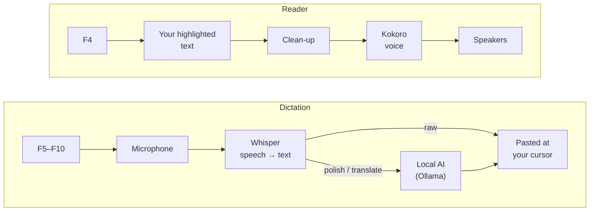

<p align="center">
  
</p>

<h1 align="center">Zero- Flow Engine</h1>

<p align="center">
  <b>Speak and it types. Highlight and it reads.</b><br/>
  A private, fully local voice engine for Windows — English and Arabic dictation into
  any app, and a natural voice that reads any text back to you.
</p>

<p align="center">
  
  
  
  
</p>

<p align="center">
  <a href="docs/INSTALL.md">Install</a> ·
  <a href="docs/HARDWARE.md">Hardware &amp; tuning</a> ·
  <a href="docs/FAQ.md">FAQ</a> ·
  <a href="docs/SETUP-CPU-LAPTOP.md">Beginner guide</a> ·
  <a href="docs/INSTALL.ar.md">بالعربية</a>
</p>

---

## What it does

**🎙️ Dictation — speech → text.** Click where you want to type, tap `F5`, speak, tap
`F5` again: your words appear at the cursor in Word, a browser, a chat app, a code
editor — anywhere `Ctrl+V` works.
- **English or Arabic**, each on its own key, so it never mishears one as the other.
- **Polish** (`F6`/`F8`): a local AI removes "um"s, repetitions and slips.
- **Translate** (`F9`/`F10`): speak English, get Arabic — or the other way round.
- **Fix a line** (`Shift+F3`): with the cursor at the end of a line you typed, press it
  and the line is corrected in place.
- **Spoken commands:** *"new line"*, *"bullet"*, *"format code"*, *"… and send"*,
  *"period"*, *"comma"*, *"question mark"* — and their Arabic equivalents.
- **Learns your words:** names and technical terms the AI meets while polishing are
  remembered, and spelled right next time.

**🔊 Reader — text → speech.** Highlight any text — a web page, a PDF, an email — and
press `F4`: a natural voice reads it aloud, starting after the first sentence. `Esc`
stops it. An optional AI pass strips menus and cookie banners first.

**🔒 Private by design.** Speech recognition, the AI and the voice all run on your PC.
After a one-time model download it works with no internet at all — nothing you say,
type or read ever leaves the machine.

## How it works



The two halves run side by side and stay out of each other's way: starting a dictation
silences the reader instantly, and the reader never speaks while the microphone is
open. Internals: [ARCHITECTURE.md](ARCHITECTURE.md).

## Which PC do I need?

Any 64-bit Windows 10/11 PC with a microphone. A graphics card makes it faster; it is
not required. Run `python check_hardware.py` and it tells you which of these you are —
and writes the matching settings for you:

| Your PC | Speech model | Words appear after* | Guide |
|---|---|---|---|
| NVIDIA card, 8 GB+ | `large-v3` (best, best Arabic) | ≈1 s | [NVIDIA desktop](docs/HARDWARE.md#nvidia-desktop--8-gb-or-more) |
| NVIDIA laptop, 4–7 GB | `medium` / `small` | ≈1 s | [NVIDIA laptop](docs/HARDWARE.md#nvidia-laptop--4-to-7-gb) |
| No graphics card | `small` / `base` | ≈2–4 s | [CPU only](docs/HARDWARE.md#cpu-only--no-graphics-card) |
| AMD Radeon / Intel Arc | `small` | ≈2–4 s | [AMD / Intel](docs/HARDWARE.md#amd-radeon--intel-arc) |

\* For about 14 s of speech. Measured on an RTX 4070 and an 8-core i7; the smaller
tiers are estimates. Full numbers and tuning: **[HARDWARE.md](docs/HARDWARE.md)**.

## Quick start

```powershell
winget install Python.Python.3.12 ; winget install Git.Git ; winget install Ollama.Ollama
cd C:\ ; git clone https://github.com/zerocold7/local-voice-flow.git ; cd local-voice-flow
python check_hardware.py            # which tier am I?
```

Then install the packages for your tier, write your settings, pull the AI model and
start **`Launch_Zero.bat`** — every step, per tier, in **[docs/INSTALL.md](docs/INSTALL.md)**.
Never done anything like this? The **[Beginner Guide](docs/SETUP-CPU-LAPTOP.md)** walks
through every click (also as a [printable PDF](docs/Zero-Flow-Setup-Guide.pdf), and
[in Arabic](docs/SETUP-CPU-LAPTOP.ar.md) · [Word](docs/SETUP-CPU-LAPTOP.ar.docx)).

## Keys

**Record keys toggle:** tap once and talk, then tap **any** record key again to stop.
(Don't hold it — key repeat would start and stop the recording over and over.)

| Key | Dictation | | Key | Actions & reader |
|---|---|---|---|---|
| `F5` | English — as spoken | | `Shift+F1` | Tidy the learned vocabulary |
| `F6` | English — polished by the AI | | `Shift+F2` | Clear the debug log & history |
| `F7` | Arabic — as spoken | | `Shift+F3` | Fix the current line |
| `F8` | Arabic — polished by the AI | | `F4` | **Read the highlighted text aloud** |
| `F9` | Translate English → Arabic | | `Esc` | Cancel recording / stop reading |
| `F10` | Translate Arabic → English | | | |

Every key can be changed in `.env` ([CONFIGURATION.md §2](CONFIGURATION.md#2-changing-hotkeys)).
Laptop F-keys changing the volume instead? Press `Fn + Esc`.

**Spoken commands.** At the **start** of a dictation: *"new line"* (starts a new line),
*"bullet"* (`• ` prefix), *"format code"* (wraps it in backticks). At the **end**:
*"and send"* (presses Enter after pasting), *"period"*, *"comma"*, *"question mark"*.
Arabic: *"سطر جديد"*, *"قائمة"* (bullet), *"تنسيق كود"* (code), *"انتر"*, and at the end
*"نقطة"*, *"فاصلة"*, *"علامة استفهام"* for **.** **،** **؟**

**Tray menu** (by the clock): choose the voice, turn on Smart Cleaning for the reader,
suspend the reader, or **Exit Engine**. Windows hides new tray icons — click `^` by the
clock to find it.

## Launchers

| Launcher | Runs |
|---|---|
| **`Launch_Zero.bat`** | **Both halves in one window, one tray icon — use this** |
| `Launch_Flow.bat` | Dictation only |
| `Launch_Reader.bat` | Reader only |
| `Launch_All.bat` | Both halves, each in its own window |

Each has a twin that starts with no window — `Launch_Zero_Silent.vbs`,
`Launch_Silent.vbs`, `Launch_Reader_Silent.vbs`, `Launch_All_Silent.vbs` — stopped from
the tray icon. To start with Windows, see the [FAQ](docs/FAQ.md#can-it-start-with-windows).

## Documentation

| | English | العربية |
|---|---|---|
| **Install** — every PC, step by step | [INSTALL.md](docs/INSTALL.md) | [INSTALL.ar.md](docs/INSTALL.ar.md) |
| **Hardware & tuning** — tiers, measured speeds, fixes | [HARDWARE.md](docs/HARDWARE.md) | [HARDWARE.ar.md](docs/HARDWARE.ar.md) |
| **Beginner guide** — no graphics card, every click | [SETUP-CPU-LAPTOP.md](docs/SETUP-CPU-LAPTOP.md) · [PDF](docs/Zero-Flow-Setup-Guide.pdf) | [SETUP-CPU-LAPTOP.ar.md](docs/SETUP-CPU-LAPTOP.ar.md) · [Word](docs/SETUP-CPU-LAPTOP.ar.docx) |
| **FAQ** | [FAQ.md](docs/FAQ.md) | |
| **Every setting** — keys, models, prompts, other AI providers, languages | [CONFIGURATION.md](CONFIGURATION.md) | |
| **How it works inside** | [ARCHITECTURE.md](ARCHITECTURE.md) | |
| **What changed** | [CHANGELOG.md](CHANGELOG.md) | |

## When something goes wrong

1. `python check_hardware.py` — every line under *Checks* should say `[ok]`.
2. Look at `flow_debug.log` (dictation) and `reader_debug.log` (reader) in the project
   folder: every transcription, fallback and failure is recorded there, with how long
   each clip took.
3. [HARDWARE.md §5](docs/HARDWARE.md#5-is-it-tuned-right-read-the-signs) matches
   symptoms to fixes; the [FAQ](docs/FAQ.md) covers the rest.

## Privacy

Audio never leaves the machine: transcription runs on-device (`faster-whisper`), the AI
runs in your local Ollama, and the voice (`Kokoro`) is local too. The speech and voice
models download once from Hugging Face — no account or `HF_TOKEN` needed — and after
that the engine makes **no network requests at all**. The only exception is one you
choose: pointing it at a cloud AI provider ([CONFIGURATION.md §6](CONFIGURATION.md#6-using-a-different-llm-provider-instead-of-ollama)).

## For developers

```bash
python -m unittest discover -s tests
```

Standard library only — no models loaded, no sound, about two seconds. It covers the
logic that breaks quietly: voice macros and spoken punctuation, sentence batching, the
reader's clean-up and audio-thread safety, vocabulary learning, hardware tiers and
presets. Start with [ARCHITECTURE.md](ARCHITECTURE.md).

## License

[MIT](LICENSE) © 2026 zerocold7
